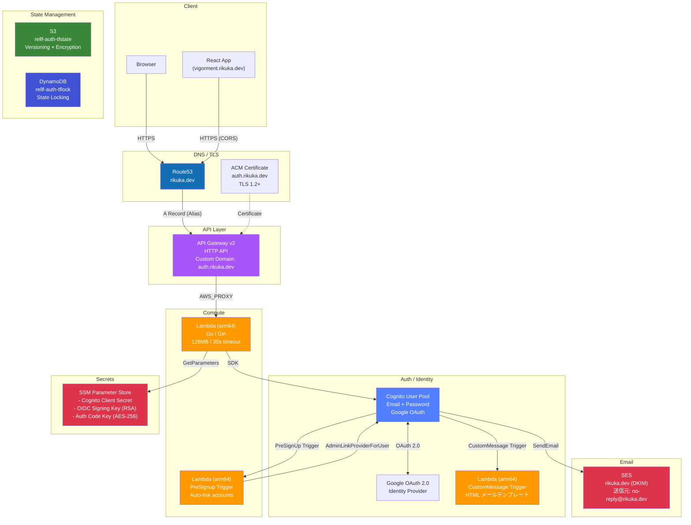

# インフラ構成

## 全体構成図

## Terraform リソース一覧

| リソース | 用途 |
|---------|------|
| `aws_cognito_user_pool.main` | ユーザープール |
| `aws_cognito_user_pool_client.main` | アプリクライアント |
| `aws_cognito_identity_provider.google` | Google OAuth 連携 |
| `aws_lambda_function.main` | API Lambda |
| `aws_lambda_function.presignup` | PreSignUp トリガー |
| `aws_lambda_function.custommessage` | CustomMessage トリガー |
| `aws_apigatewayv2_api.main` | HTTP API |
| `aws_apigatewayv2_domain_name.main` | カスタムドメイン |
| `aws_sesv2_email_identity.main` | SES ドメイン認証 |
| `aws_route53_record.ses_dkim` | DKIM レコード (x3) |
| `aws_acm_certificate.main` | TLS 証明書 |
| `aws_ssm_parameter.*` | シークレット管理 |
| `aws_s3_bucket` / `aws_dynamodb_table` | Terraform state |
